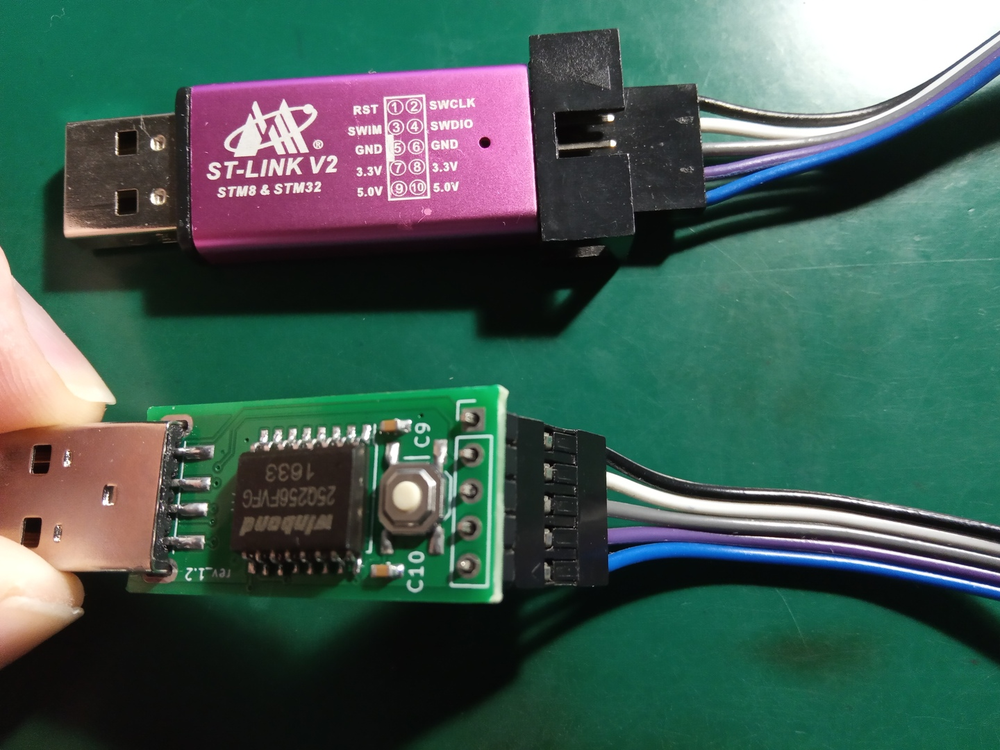

# 12004-pocketadmin-wiki  
This repository contains an old rev 1.2 [wiki](https://github.com/krakrukra/12004-pocketadmin-wiki/wiki) for PocketAdmin badusb,  
and also several rev 1.2 firmware images. If you have purchased the  
new 1.3 revision of PocketAdmin, or you have updated to 12005 backport  
firmware, you should instead go to the [official PocketAdmin repository](https://github.com/krakrukra/PocketAdmin)  
  
Keep in mind that 12005 firmware does not give you all of the new  
capabilities, because it is based on older hardware. Specifically,  
you will not get higher read/write speed, increased capacity, status  
LED; "MASS_ERASE", "USE_HIDDEN_REGION", "SHOW_FAKE_CAPACITY **n**"  
commands will not be available; There also may be some backport  
specific bugs, although, I have not found any yet. In case some  
kind of bugs / problems arise, you should be able to restore the  
device's operation by flashing previous 12004 / 12003 firmwares again.  
  
#### Make sure you know what you are doing before attempting the update  
  
In order to flash rev 1.2 devices you have to use hardware programmer  
device [ST-Link V2](https://www.aliexpress.com/item/1PCS-ST-LINK-Stlink-ST-Link-V2-Mini-STM8-STM32-Simulator-Download-Programmer-Programming-With-Cover/32792513237.html?ws_ab_test=searchweb0_0,searchweb201602_2_10152_10151_10065_10344_10068_10342_10546_10343_10340_10548_10341_10696_10084_10083_10618_10307_10135_10133_10059_100031_10103_10624_10623_10622_10621_10620,searchweb201603_55,ppcSwitch_3&algo_expid=448b8f37-4a09-4701-bf7f-8b2ce2770a23-0&algo_pvid=448b8f37-4a09-4701-bf7f-8b2ce2770a23&priceBeautifyAB=0) and possibly some male to female 1x5 pin programming  
cable, similar to [this one](https://www.aliexpress.com/item/33033050535.html?spm=a2g0o.detail.1000060.1.7dcf101bArxwCe&gps-id=pcDetailBottomMoreThisSeller&scm=1007.14977.145068.0&scm_id=1007.14977.145068.0&scm-url=1007.14977.145068.0&pvid=b677e088-cfb7-41ac-8ac0-e2bdfb464d52&_t=gps-id:pcDetailBottomMoreThisSeller,scm-url:1007.14977.145068.0,pvid:b677e088-cfb7-41ac-8ac0-e2bdfb464d52). You could use alternative ways, like  
using 5 single-pin cables, etc; but you should always make sure that  
all the necessary holes on the device are connected to the matching  
pins on the programmer. An example of correct connection is shown in  
the picture below. Notice all the wire colors, and the fact that  
the button + memory chip are on the top.  
  
  
  
You can check [this video](https://www.youtube.com/watch?v=t0oajBFZcZY) for a demonstration of  
both old and new firmware update procedures.  
  
---
  
#### linux (debian) update procedure (rev 1.2 hardware)  
  
1. install openocd (sudo apt-get install openocd)  
2. download this repository (.zip) to your PC and unpack it  
3. open terminal window in /binaries_12xxx/ directory  
4. connect the correct holes on device to correct ST-Link V2 pins  
5. connect the ST-Link V2 to PC  
6. run the following command (it is one line), wait for process to finish:  
  
> openocd -s ./openocd -f stlink-v2.cfg -f stm32f0x.cfg -c "program firmware_12005 verify reset exit 0x08000000"  
  
You can instead specify firmware_12004 or firmware_12003, if necessary.  
  
---
  
#### windows update procedure (rev 1.2 hardware)  
  
1. install openocd from their [website](http://openocd.org/getting-openocd)  
2. install St-Link V2 drivers from [here](https://www.st.com/en/development-tools/stsw-link009.html)  
3. download this repository (.zip) to your PC and unpack it  
4. open terminal window in /binaries_12xxx/ directory  
4. connect the correct holes on device to correct ST-Link V2 pins  
5. connect the ST-Link V2 to PC  
6. run a similar flashing command (it is one line), wait for process to finish:  
  
> openocd.exe -s ./openocd -f stlink-v2.cfg -f stm32f0x.cfg -c "program firmware_12005 verify reset exit 0x08000000"  
  
You will probably need to either add openocd.exe into your search path, or  
specify an absolute path instead of just openocd.exe, for example this:  
  
> C:\openocd-0.10.0\bin-x64\openocd.exe -s ./openocd -f stlink-v2.cfg -f stm32f0x.cfg -c "program firmware_12005 verify reset exit 0x08000000"  
  
Again, you can instead specify firmware_12004 or firmware_12003, if necessary.  
  